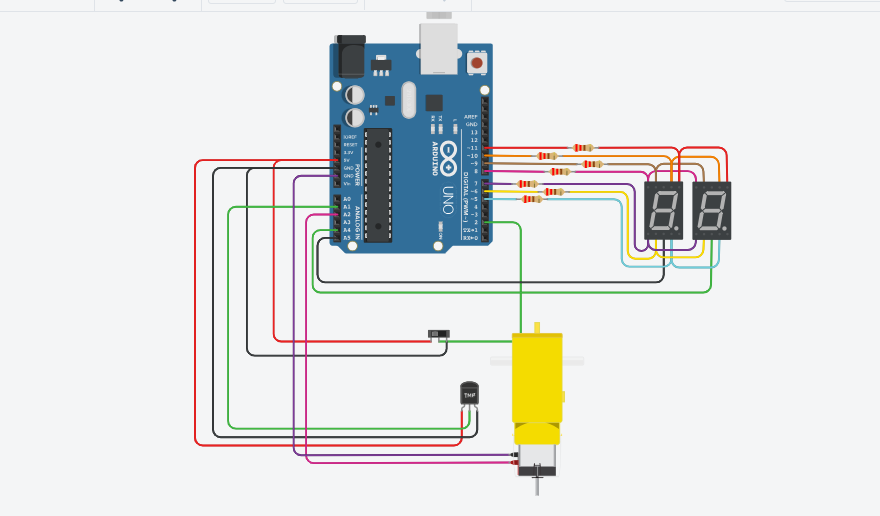
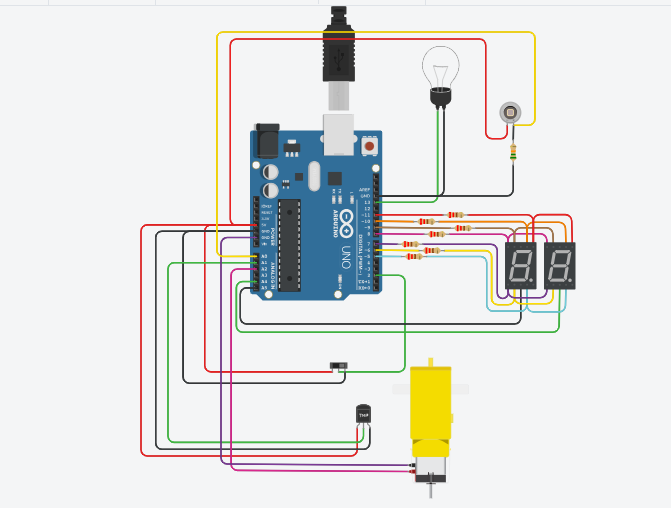
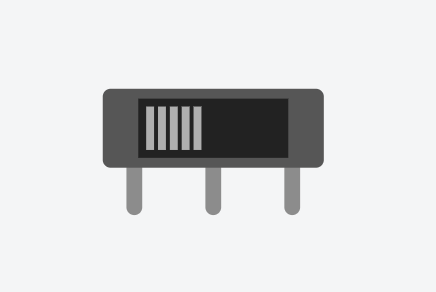
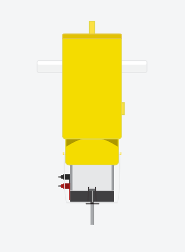
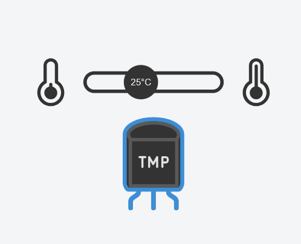
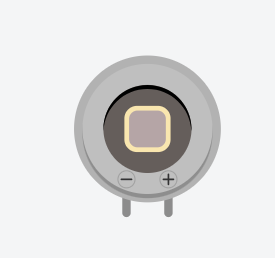

## Documentación 

## Integrantes 
- Rafael Alfredo León Antón
- DNI: 95880951
- Renzo Gomez Rettori
- DNI: 37053986

## Proyecto Parte 1: Contador

## Descripción
En este proyecto se diseñó un contador de 0 a 99 mostrando los numeros mediante dos display con la técnica de multiplexación.
Tiene tres botones para poder aumentar, disminuir o reiniciar la cuenta. 
(la tecnica de multiplexación sirve para que los dos displays puedan compartir las salidas digitales, se encarga de prender un displays
mientras apaga el otro y viceversa tan rapido que el ojo humano no lo persive y se ven los dos displyas "prendidos" todo el tiempo). 

## Función
~~~ C (lenguaje en el que esta escrito)
void mostrarContador(int contador){
  
  	int decenas;
  	int unidades;
  
  	decenas = contador/10;
  	unidades = contador%10;
  
  	digitalWrite(DECENA, LOW);
  	digitalWrite(UNIDAD, LOW);
 
    imprimirDigito(decenas);
  
 	digitalWrite(DECENA, HIGH);
  	//digitalWrite(UNIDAD, LOW);
  
	delay(50);
  	digitalWrite(DECENA, LOW);
  	digitalWrite(UNIDAD, LOW);
  
  	imprimirDigito(unidades);
  
  	digitalWrite(DECENA, LOW);
  	digitalWrite(UNIDAD, HIGH);
  	delay(50);
}
~~~
## Proyecto Parte 2: Interruptor Deslizante y Números Primos con Motor de aficionado

## Descripción
Se agregó un boton deslizante, en reemplazo de los tres botones, con la funcion de mostrar el contador de 0 a 99 cuando esta en HIGH (ON). Y solo los numeros primos cuando esta en LOW (OFF).
Tambien se agrega un motor, conectado a un sensor de temperatura, con la función de activarse cuando la temperatura varia
entre los 50° a 100° grados celcius.

## Función
Esta función se encarga de prender y apagar el motor segun el valor del sensor de temperatura.

~~~ C (lenguaje en el que esta escrito)
void controlarMotor(float temperatura, int tempMin, int tempMax) {
  if (temperatura >= tempMin && temperatura <= tempMax) {
    encenderMotor();
  } else {
    apagarMotor();
  }
}      
void encenderMotor() {
  digitalWrite(MOTOR_1, HIGH);
}

void apagarMotor() {
  digitalWrite(MOTOR_1, LOW);
}
~~~
## Proyecto Parte 3: Fotodiodo

## Descripción
Se agrego un Fotodiodo sensible a la incidencia de la luz.

## Función
Condicional que sirve para prender o apagar la bombilla segun el valor del fotodiodo
~~~ C (lenguaje en el que esta escrito)
if (valorFotodiodo >= umbralMin && valorFotodiodo <= umbralMax) {
    	digitalWrite(BOMBILLA, HIGH);  // Enciende el LED (representando la bombilla)
  } else {
    	digitalWrite(BOMBILLA, LOW);   
  }
~~~
## Boton deslizante

Los interruptores son dispositivos eléctricos que tienen dos estados fijos, apagado y encendido, normalmente se les cambia de estado
mediante un mecanismo.

## Motor de aficionado

Es una máquina que convierte energía eléctrica en mecánica, provocando un movimiento rotatorio.

## Sensor de temperatura

Son componentes eléctricos y electrónicos que, en calidad de sensores, permiten medir la temperatura 
mediante una señal eléctrica determinada.

## Fotodiodo

Es un semiconductor construido con una unión PN, sensible a la incidencia de la luz visible o infrarroja. Para que su funcionamiento sea
correcto se polariza inversamente, con lo que se producirá una cierta circulación de corriente cuando sea excitado por la luz.

## :alien: Links del os proyectos
- [Proyecto Parte Uno](https://www.tinkercad.com/things/hkAItijYbKW-primerparcial/editel)
- [Proyecto Parte Dos](https://www.tinkercad.com/things/5mqfWWkbnb2-copy-of-primerparcialmotor2parte/editel?tenant=circuits)
- [Proyecto Parte Tres](https://www.tinkercad.com/things/1rRnbiA9Vgf-copy-of-primerparcialmotor2parte/editel?tenant=circuits)

## Fuentes
