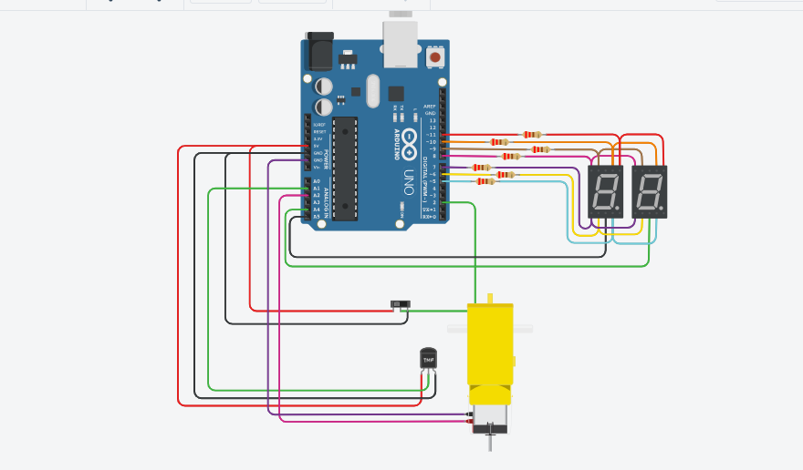

## Documentación 

## Integrantes 
- Rafael Leon
- Renzo Gomez Rettori

## Proyecto: Contador

## Descripción
En este proyecto se diseñó un contador de 0 a 99 mostrando los numeros mediante dos display y teniendo 3 botones para poder bajar, subir o reiniciar la cuenta

## Función

## Proyecto: Interruptor Deslizante y Números Primos con Motor de aficionado

## Descripción
Se agregó un boton deslizante, en reemplazo de los botones, con la funcion de mostrar el contador de 0 a 99 cuando esta en HIGH
y solo los numeros primos cuando esta en LOW.
Tambien se agrega un motor, conectado a un sensor de temperatura, con la función de activarse cuando cuando la temperatura varia
entre los 50° a 100° grados celcius

## Función

## Boton deslizante

Los interruptores son dispositivos eléctricos que tienen dos estados fijos, apagado y encendido, normalmente se les cambia de estado mediante un mecanismo.

## :alien: Links del os proyectos
- [ProyectoParteUno](https://www.tinkercad.com/things/hkAItijYbKW-primerparcial/editel)
- [ProyectoParteDos](https://www.tinkercad.com/things/5mqfWWkbnb2-copy-of-primerparcialmotor2parte/editel?tenant=circuits)
