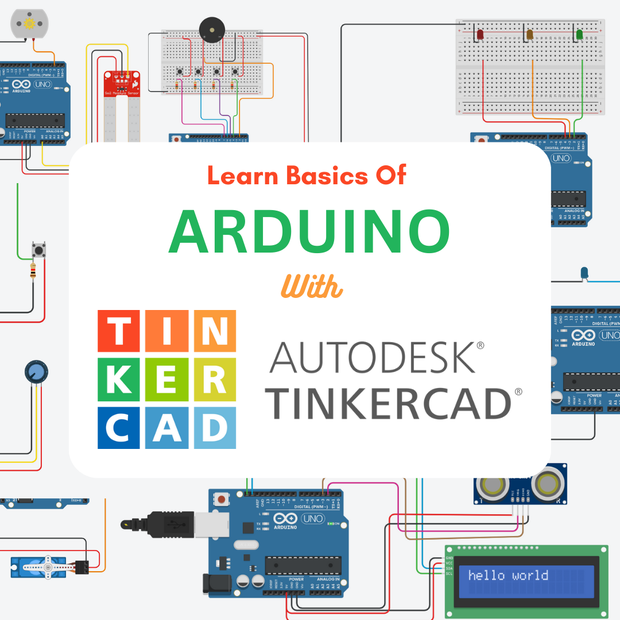
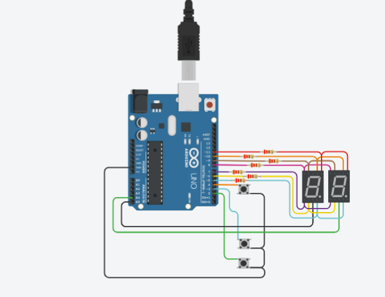

# Documentación 

## Integrantes 
- Rafael Leon
- Renzo Gomez Rettori

## Proyecto: Contador binario.

# Descripción
En este proyecto se diseño un contador de 0 a 99 mostrando los numeros mediente dos display y teniendo 3 botones para poder bajar, subir o reiniciar la cuenta

## Función
